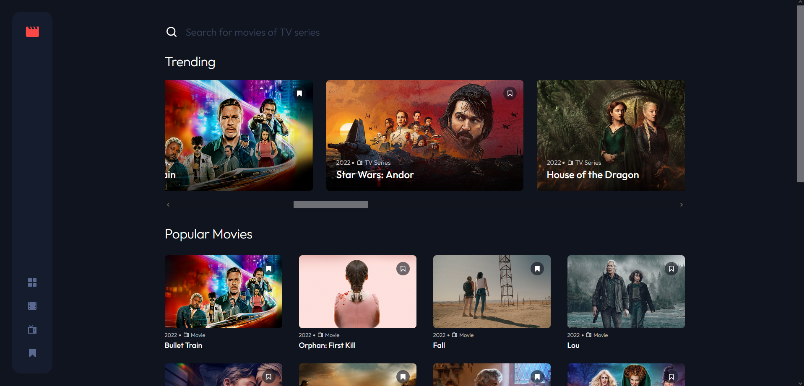

# Entertainment web app

## Table of contents

- [Overview](#overview)
  - [The challenge](#the-challenge)
  - [Screenshot](#screenshot)
  - [Links](#links)
- [My process](#my-process)
  - [Built with](#built-with)
  - [Prerequisites](#prerequisites)
- [Author](#author)

## Overview

### The challenge

Users should be able to:

- View the optimal layout for the app depending on their device's screen size
- See hover states for all interactive elements on the page
- Navigate between Home, Movies, TV Series, and Bookmarked Shows pages
- Add/Remove bookmarks from all movies and TV series
- Search for relevant shows on all pages

### Screenshot



### Links

- Solution URL: [Add solution URL here](https://your-solution-url.com)
- Live Site URL: [Add live site URL here](https://your-live-site-url.com)

## My process

### Built with

- Semantic HTML5 markup
- CSS custom properties
- Flexbox
- CSS Grid
- Mobile-first workflow
- [React](https://reactjs.org/) - JS library

### Prerequisites

1. Create an API KEY [TMDB API](https://www.themoviedb.org/documentation/api)
2. Create an `.env` file in the root directory of the project
3. Add an environment variables to the `.env` file:

```

REACT_APP_TMDB_API_KEY="YOUR_TMDB_API_KEY"

```

## Author

- Frontend Mentor - [@alvinsalgado](https://www.frontendmentor.io/profile/alvinsalgado)
